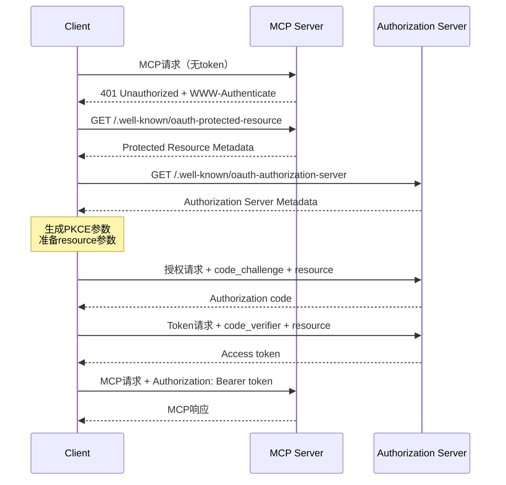

# MCP OAuth 2.1 规范合规性实现

## 概述

本文档说明了IamDog应用如何实现符合MCP规范的OAuth 2.1鉴权机制。

## 实现的规范

### 1. OAuth 2.0 Protected Resource Metadata (RFC 9728)

**实现文件**: `electron/mcpAuthDiscovery.ts`

MCP服务器必须实现Protected Resource Metadata来告知客户端其授权服务器的位置。

#### 发现流程：

1. 客户端尝试连接MCP服务器（不带token）
2. 服务器返回401 Unauthorized，包含`WWW-Authenticate` header
3. 从header中提取`resource_metadata` URL
4. 如果没有，使用标准路径：`/.well-known/oauth-protected-resource`
5. 获取Protected Resource Metadata，包含：
   - `resource`: MCP服务器的规范URI
   - `authorization_servers`: 授权服务器URI列表

#### 示例：

```typescript
const discovery = await discoverAuthorizationServer('https://mcp.example.com/mcp');
// 返回：
// {
//   resourceUri: 'https://mcp.example.com/mcp',
//   authServerMetadata: { ... },
//   protectedResourceMetadata: { ... }
// }
```

### 2. OAuth 2.0 Authorization Server Metadata (RFC 8414)

客户端必须使用Authorization Server Metadata来获取授权服务器的端点信息。

#### 发现路径：

```
{authorization_server}/.well-known/oauth-authorization-server
```

#### 获取的信息：

- `issuer`: 授权服务器标识符
- `authorization_endpoint`: 授权端点
- `token_endpoint`: Token端点
- `registration_endpoint`: 动态客户端注册端点（可选）
- `scopes_supported`: 支持的作用域
- `code_challenge_methods_supported`: PKCE支持（必须包含S256）

### 3. Resource Indicators for OAuth 2.0 (RFC 8707)

**关键要求**: 客户端必须在授权和token请求中包含`resource`参数。

#### 规范URI生成：

```typescript
// 输入: https://mcp.example.com:8443/mcp/v1
// 输出: https://mcp.example.com:8443/mcp/v1

const resourceUri = getCanonicalResourceUri(mcpServerUrl);
```

规则：
- 小写scheme和host
- 移除默认端口（443 for https, 80 for http）
- 保留路径（如果有）
- 移除fragment
- 移除尾部斜杠（除非语义上必需）

#### 在OAuth流程中使用：

```typescript
// 授权请求
authUrl.searchParams.set('resource', config.oauth.resource);

// Token请求
params.append('resource', config.oauth.resource);
```

### 4. PKCE (Proof Key for Code Exchange)

**要求**: 所有客户端必须实现PKCE，使用S256方法。

#### 实现：

```typescript
// 生成code_verifier
const codeVerifier = randomBytes(64).toString('base64url').slice(0, 128);

// 生成code_challenge
const hash = createHash('sha256');
hash.update(codeVerifier);
const codeChallenge = hash.digest('base64url');

// 授权请求
authUrl.searchParams.set('code_challenge', codeChallenge);
authUrl.searchParams.set('code_challenge_method', 'S256');

// Token请求
params.append('code_verifier', codeVerifier);
```

### 5. Token使用和验证

#### 客户端要求：

1. **必须**使用Authorization header传递token：
   ```http
   Authorization: Bearer <access-token>
   ```

2. **必须不**在URI query string中包含token

3. **必须**只向目标MCP服务器发送该服务器的token（不能透传）

#### 服务器要求：

1. **必须**验证token是专门为该服务器颁发的（audience验证）
2. **必须**在token无效或过期时返回401
3. **必须不**接受或转发其他服务器的token

### 6. WWW-Authenticate Header处理

当MCP服务器返回401时，必须包含WWW-Authenticate header：

```http
HTTP/1.1 401 Unauthorized
WWW-Authenticate: Bearer realm="mcp", 
                  resource_metadata="https://mcp.example.com/.well-known/oauth-protected-resource"
```

客户端解析此header获取resource_metadata URL。

## 完整鉴权流程



## 代码结构

### 核心模块

1. **mcpAuthDiscovery.ts**: 授权服务器发现
   - `discoverAuthorizationServer()`: 完整发现流程
   - `getCanonicalResourceUri()`: 生成规范URI
   - `validatePKCESupport()`: 验证PKCE支持
   - `validateResourceIndicatorsSupport()`: 验证Resource Indicators支持

2. **oauthManager.ts**: OAuth 2.1流程实现
   - PKCE生成和验证
   - 授权码流程
   - Token刷新
   - Resource参数支持

3. **mcpManager.ts**: MCP服务器管理
   - 集成授权服务器发现
   - Token生命周期管理
   - 自动token刷新

4. **mcpClient.ts**: MCP客户端
   - Token注入到请求
   - 401响应处理

## 安全考虑

### 1. Token盗用保护

- 使用PKCE防止授权码拦截
- 短期access token（服务器控制）
- Refresh token轮换（服务器实现）

### 2. 通信安全

- 所有授权服务器端点必须使用HTTPS
- Redirect URI必须是localhost或HTTPS

### 3. CSRF保护

- 使用state参数并验证

### 4. Token Audience绑定

- 客户端必须发送resource参数
- 服务器必须验证token的audience
- 禁止token透传

### 5. 混淆代理问题

- MCP代理服务器必须为每个动态注册的客户端获取用户同意
- 不能复用静态client ID访问第三方API

## 与旧实现的区别

### 旧方法（错误）：

```typescript
// ❌ 直接使用配置的URL，没有发现流程
const tokens = await oauthManager.authorize({
  authUrl: 'https://auth.example.com/authorize',
  tokenUrl: 'https://auth.example.com/token',
  // 缺少resource参数
});
```

### 新方法（正确）：

```typescript
// ✅ 使用发现流程
const discovery = await discoverAuthorizationServer(mcpServerUrl);

const tokens = await oauthManager.authorize({
  authUrl: discovery.authServerMetadata.authorization_endpoint,
  tokenUrl: discovery.authServerMetadata.token_endpoint,
  resource: discovery.resourceUri,  // RFC 8707
  clientId: '...',
  scopes: discovery.authServerMetadata.scopes_supported || [],
  redirectUri: 'http://localhost:3000/oauth/callback'
});
```

## 预设配置的兼容性

对于已有OAuth配置的服务器，系统仍然支持预设配置（`mcpOAuthPresets.ts`），但会：

1. 自动添加resource参数（基于MCP服务器URL）
2. 验证配置的端点是否匹配发现的端点（可选）
3. 在未来版本中逐步迁移到完全基于发现的方式

## 测试验证

### 验证checklist：

- [ ] 授权服务器发现流程正常工作
- [ ] WWW-Authenticate header正确解析
- [ ] Resource参数在授权和token请求中存在
- [ ] PKCE S256正确实现
- [ ] Token正确注入到Authorization header
- [ ] 401响应触发重新授权
- [ ] Token刷新正常工作
- [ ] 不同MCP服务器的token隔离

## 未来改进

1. **动态客户端注册** (RFC 7591)
   - 自动注册客户端，无需手动配置client ID
   - 支持registration_endpoint

2. **Token刷新优化**
   - 后台自动刷新
   - 刷新失败的优雅降级

3. **更好的错误处理**
   - 区分不同类型的401错误
   - 用户友好的错误提示

4. **审计和日志**
   - 记录所有授权活动
   - 安全事件监控

## 参考资料

- [MCP Authorization Specification](https://modelcontextprotocol.io/specification/2025-06-18/basic/authorization)
- [OAuth 2.1 Draft](https://datatracker.ietf.org/doc/html/draft-ietf-oauth-v2-1-13)
- [RFC 8414 - Authorization Server Metadata](https://datatracker.ietf.org/doc/html/rfc8414)
- [RFC 9728 - Protected Resource Metadata](https://datatracker.ietf.org/doc/html/rfc9728)
- [RFC 8707 - Resource Indicators](https://www.rfc-editor.org/rfc/rfc8707.html)
- [RFC 7636 - PKCE](https://datatracker.ietf.org/doc/html/rfc7636)
- [RFC 7591 - Dynamic Client Registration](https://datatracker.ietf.org/doc/html/rfc7591)
